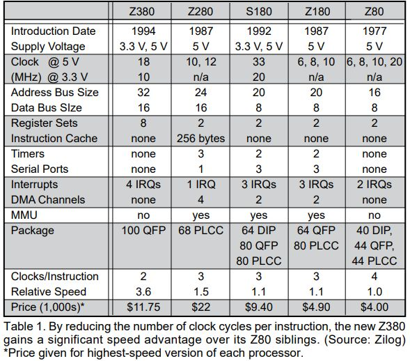

# Mangalarga
An MSX2+ based computer using the Zilog Z380 microprocessor and no FPGAs

## XRX - eXperimental Research X
The prototyping phase of this project is called ["XRX"](https://hackaday.io/project/205929-xrx-experimental-research-x) and is being developed as an ongoing effort.
The first board for production is called "Mangalarga" in homage to the Brazilian horse breed known for its exceptionally smooth gaits, great stamina, and gentle temperament.

## Technical Specifications

- Zilog Z380 microprocessor
- 14.32 MHz maximum clock speed
- 8MB fast 16-bit word SDRAM
- 512kB 8-bit Flash memory
- V9958 Video Display Processor
- Composite and S-video output
- AY-3-8912 Programmable Sound Generator
- Mono headphones output
- 2 joystick ports
- 2 MSX-compatible primary slots
- RTC emulated
- SD-Card
- IBM-PC compatible power connector
- mini-DTX board form-factor

## History

XRX started as an exploration of whether the Z380 - a Z80-compatible
extension Zilog shipped in the 1990s but which, as far as is documented,
no MSX manufacturer ever adopted - could drive a real MSX-compatible
machine. Early bring-up work targeted a CPLD (ispMACH4000ZE)
implementing the slot/mapper/I/O decode logic a real MSX chipset would
otherwise provide, with c-bios as the first boot target.

Milestones reached so far, roughly in order:

- c-bios boots and runs real MSX software (e.g. Antarctic Adventure) on
  real hardware.
- Expanded slot's four subslots (memory-mapped RAM, Sub-ROM, Kanji/BASIC
  extension, Nextor) brought up and confirmed working.
- A companion STM32L010K8T6 MCU added to emulate an RP-5C01 real-time
  clock and expose a raw-sector SD-card API to the Z380 bus, since XRX
  has no dedicated RTC or SD-card controller chip of its own.
- Nextor (the MSX-DOS 2-compatible OS) ported to run from the expanded
  slot's Nextor subslot, confirmed booting cleanly to a BASIC prompt on
  real hardware. SD-card disk I/O through Nextor's driver is still being
  brought up - see "Software" below.
- PSG working properly, but there are still issues with the AmpOps.
- Keyboard is working properly.
- SRAM chips used in the VDP are working properly.

Several of the trickiest bugs along the way turned out to share one
root cause: the Z380's memory and I/O buses run on independent,
decoupled state machines, so code written for a real Z80 (which
guarantees the bus has settled by the time the next instruction runs)
can race ahead of a slot- or mapper-register write before the hardware
has actually latched it.

## Hardware

### System overview

The Z380 CPU sits on an MSX-compatible bus, with a CPLD
(ispMACH4000ZE) standing in for a real MSX chipset's slot decode,
memory mapper, and I/O port decode. A V9958 VDP and AY-3-8912 PSG
provide video and audio the usual MSX way. A companion STM32L010K8T6 
MCU emulates an RP-5C01 RTC and exposes a raw-sector SD-card API over 
the same Z380 I/O bus, using `/WAIT` to stall the CPU while it services
a request.

### Zilog Z380

The Z380 was introduced to the American market in 1994 by Zilog as an extension (and instruction set compatible) of the successful Z80. However, it had already been shipping to Japanese customers for a year before that but unfortunately none of them were willing to use it in an MSX-compatible machine. [[1]](doc/sources/080901.pdf) [[2]](https://www.theregister.com/2024/04/26/long_live_16_bit_z80/)

Here is a small table comparing the different Zilog processors at the time:



Zilog's original documents mention speeds of up to 40MHz, but I could only find the 18MHz version. We will not discuss the Z382 version, even more difficult to find these days.

### Clock management

There are 2 clock sources in the system:

- VDP clock output (3.58MHz)
- PLL 4x multiplier (14.32MHz)

The Z380 microprocessor has 2 different clock domains: the BUSCLK for the memory operations and the IOCLK for I/O operations. The source for the BUSCLK is the 4x PLL output.

After a reset, the MSX-patched BIOS will program Z380's internal registers to use BUSCLK divided by 4 as the base clock for I/O operations. In practice, memory operations are executed at 14,32MHz and I/O operations are executed at 3.58MHz.

### Wait states

The Z380 internal wait-states generators are being used. 

- 0 wait states are being used for memory operations (both RAM and ROM)
- 5 wait states are being used for I/O operations

Exceptionally, in the CPLD there is a more complex wait generation logic for VDP accesses.

### Memory

The memory mapper uses four 3-bit page registers (ports `FCh` through `FFh`) to map 16 KB windows into the Z380's lower address space when slot 3-0 is selected. This reduced configuration makes a total of 128 KB of mapper RAM available, due to a CPLD limitation.

The whole RAM memory is available at slot 3-0. It is accessed in words of 16 bits. If any A16 ~ A22 signal is active, the memory mapper is bypassed and the Z380 microprocessor will access the memory as a linear space.

The ROM is accessed in bytes, just like in the Z80. It contains the BIOS, BASIC, and the MSX2+ sub-ROM.

#### Slot map

```
+------------------+--------+----------+----------+--------+--------+--------+--------+
|                  | Slot 0 |  Slot 1  |  Slot 2  |Slot 3-0|Slot 3-1|Slot 3-2|Slot 3-3|
+------------------+--------+----------+----------+--------+--------+--------+--------+
|  10000h~7FFFFFh  |        |          |          |  8MB   |        |        |        |
+------------------+--------+----------+----------+--------+--------+--------+--------+
| Page C000h~FFFFh |        |          |          |        |        |        |        |
+------------------+        |          |          | 128kB  +--------+        |        |
| Page 8000h~BFFFh |        |Cartridge |Cartridge | Memory |        |        |        |
+------------------+--------|  Slot 1  |  Slot 2  | Mapper | Kanji  |        |        |
| Page 4000h~7FFFh |        |          |          |        |        |        |        |
+------------------+  Main  |          |          |        +--------+        |        |
| Page 0000h~3FFFh |  ROM   |          |          |        |Sub-ROM |        |        |
+------------------+--------+----------+----------+--------+--------+--------+--------+
```

Slot 3-1 detail:

- Page 0000h~3FFFh: Sub-ROM
- Page 4000h~7FFFh: Kanji/BASIC extension
- Page 8000h~BFFFh: Kanji/BASIC extension

### I/O space

Standard MSX port assignments, plus two ports of XRX's own for the companion STM32 MCU:

| Port(s)  | Device |
|---|---|
| `#98`-`#9B` | V9958 VDP |
| `#A0`-`#A3` | AY-3-8912 PSG |
| `#A8` | PPI-A (primary slot register) |
| `#A9` | PPI-B (keyboard column input) |
| `#AA` | PPI-C (key click, caps LED, cassette out/motor, keyboard row output) |
| `#AB` | PPI mode/control register |
| `#B4`-`#B5` | RTC (RP-5C01, emulated by the STM32 companion MCU) |
| `#B6` | SD-card raw-sector API (STM32 companion MCU) |
| `#F3` | VDP display mode select (MSX2+) |
| `#FC`-`#FF` | Memory mapper page registers |

Two ports (`#B4`-`#B5` and `#B6`) don't exist on a real MSX chipset -
they're XRX's own, backing the RTC and SD-card features that a real
machine would get from dedicated peripheral chips instead of a companion
MCU.

### Slots

Slot selection follows the standard MSX primary/expanded-slot model:
the PPI-A port (`#A8`) sets a 2-bit primary slot number per CPU page
(0-3), and when a page's primary slot is 3 ("expanded"), a second
register - `expanded_slot_reg`, written through address `FFFFh` - picks
one of 4 subslots for that page instead. See the "Slot map" table above
for what lives where.

## Software

### BIOS / c-bios

[c-bios](https://cbios.sourceforge.net/) boots and runs real MSX software on real hardware. "Antartic 
Adventure" was flashed in a simulated Slot3-3 and was initialized
and ran perfectly.

### Nextor (MSX-DOS 2)

[Nextor](https://github.com/Konamiman/Nextor/releases/tag/v2.1.4) boots cleanly to a BASIC prompt from the expanded
slot's Nextor subslot (slot 3-2) on real hardware. XRX's device-based 
SD-card driver is recognized correctly during boot.

Actual disk I/O through that driver is still being brought up: running
`_FDISK` from a booted prompt currently returns a disk error. Real
sector read/write traffic (as opposed to the initialization/status/
capacity commands already confirmed working) hasn't been exercised on
real hardware yet, on either the Z380 driver side or the STM32 firmware
side.

### RTC + SD-card firmware (STM32 companion MCU)

A companion STM32 microcontroller emulates the Ricoh RP-5C01 RTC and 
exposes the SD-card raw-sector API Nextor's driver talks to, over the 
I/O ports above. RTC register read/write timing and the SD-card 
init/negotiation path are confirmed working on real hardware; 
`SET TIME`/`GET TIME` still return incorrect values on real hardware 
and are being investigated.

## Software

The original MSX2+ BIOS is being used. However, it was necessary to apply fixes to several BIOS routines to synchronize the Z380’s I/O operations.
As mentioned above, the Z380 has two different clock domains, so I/O operations are always slower than memory operations (2 to 8 times slower).
This poses a major problem for MSX-based machines, since primary slots and memory mapping operations use I/O ports, and the Z80 executes these instructions sequentially, regardless of anything else.
In contrast, the Z380, which uses a pipelined architecture, performs I/O operations asynchronously.

## Roadmap


